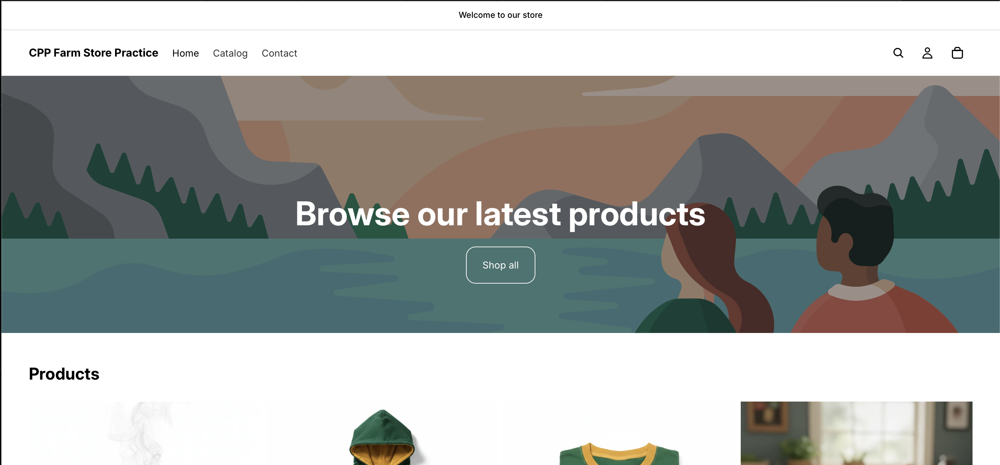
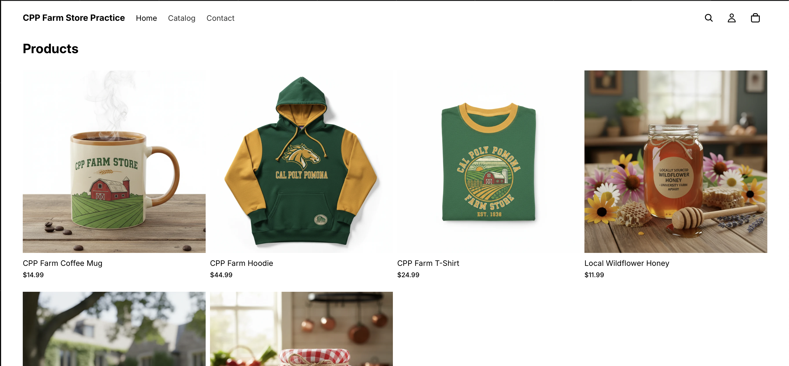
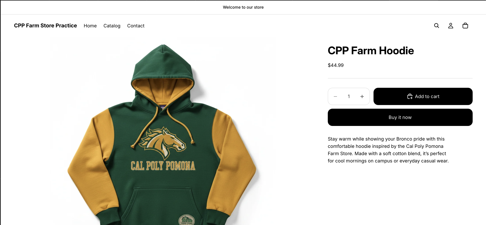
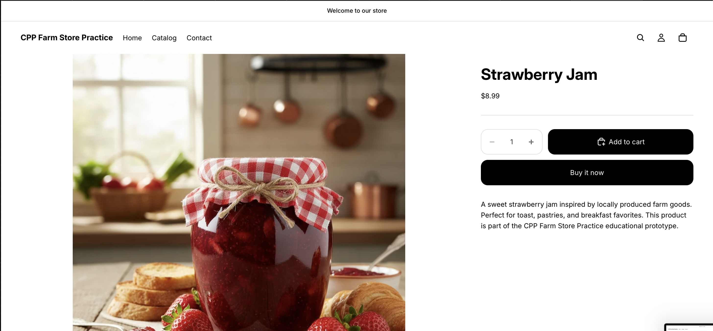
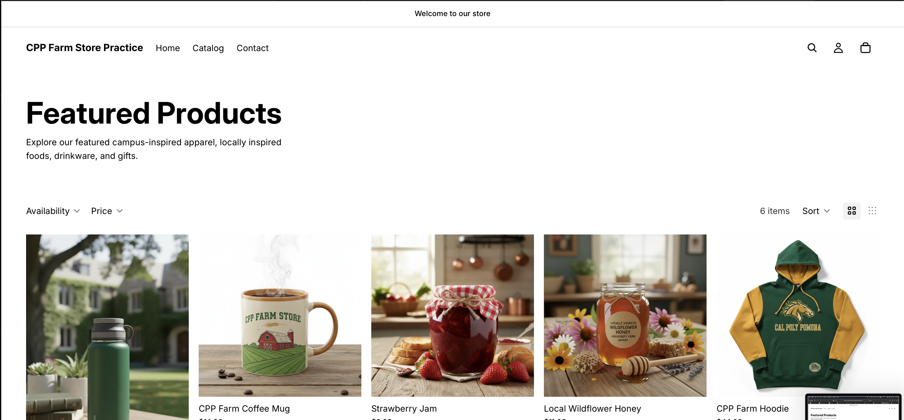

# Introduction

This report documents the improvements I made to my Shopify practice store, **CPP Farm Store Practice**, to improve its storefront design and customer experience. The goal was to create a more visually appealing, informative, and user-friendly shopping experience while supporting product discovery and customer engagement.

# Homepage Improvement Evidence

*Figure 1. Updated homepage featuring an improved hero banner, clear branding, and a call-to-action button.*

*Figure 2. Homepage displaying featured products and collection links to improve product discovery.*

# Product Page Improvement Evidence

*Figure 3. Updated product page for the CPP Farm Hoodie with product image, description, price, and inventory.*

*Figure 4. Updated product page for Strawberry Jam with improved product information, pricing, and availability.*

*Figure 4. Updated product page for Local Wildflower Honey with improved product information.*

# Collection Page Improvement Evidence

*Figure 5. Featured Products collection page displaying multiple products in a single collection.*

# Customer Experience Improvements

The following improvements were made to enhance the customer experience:

1.  Improved homepage messaging with a clear hero banner and call-to-action button to guide visitors toward shopping.
2.  Added product images, inventory, and improved product information to make product pages more informative and visually appealing.
3.  Created a Featured Products collection to improve product discovery and navigation throughout the storefront.

# Customer Journey Reflection

A customer visiting the store first lands on the homepage, where the hero banner introduces the store and encourages browsing. Featured products and the collection section provide quick access to popular items. From there, customers can open individual product pages to review product images, descriptions, prices, and availability before deciding whether to purchase. This navigation structure creates a simple and intuitive shopping experience that encourages product discovery.

# CPP Farm Store Application Reflection

The CPP Farm Store should design its online storefront with both usability and trust in mind. A welcoming homepage, organized collections, high-quality product images, and detailed product information help customers quickly understand what the store offers. Clear navigation, accurate inventory, and consistent branding also improve customer confidence and support future digital marketing efforts such as Google Shopping Ads and social media promotions.

# Appendix

## GitHub Repository

<https://github.com/Tarana7/ITP-W07-Shopify-Storefront-Design>

## GitHub Pages

<https://tarana7.github.io/ITP-W07-Shopify-Storefront-Design/>
